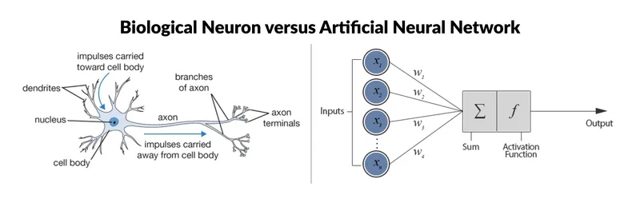

# Introduction to Deep Learning with PyTorch

## What is Deep Learning?

Deep Learning is a subfield of machine learning that uses neural networks with multiple layers to learn patterns from data. It is inspired by the structure and function of the human brain, where neurons are connected in complex layers.

A neural network is composed of individual neurons that take inputs, apply weights and biases, pass the result through an activation function, and output a value. Stacking multiple layers of these neurons creates a deep neural network (DNN).


## Deep Neural Networks (DNN) Overview

**🧠 Brain vs Neural Network Analogy**

The human brain is made up of neurons connected by synapses. Each neuron receives signals, processes them, and passes them to other neurons.

A **deep neural network (DNN)** mimics this idea:

- **Artificial neurons** take numeric inputs
- They apply weights and biases (like brain signals)
- Outputs are passed layer to layer
- The network "learns" by adjusting these weights

Just like your brain learns patterns over time, DNNs learn patterns from data.

 <p align="center">
  
</p>
## When Do We Use Deep Learning?

Deep learning is useful when:

- The dataset is large
- The relationship between input and output is highly non-linear
- Manual feature engineering is difficult or impossible
- The data is unstructured (images, audio, text)

Examples include image recognition, natural language processing, medical diagnosis, and recommendation systems.

## What is a Deep Neural Network (DNN)?

A DNN is a neural network where each neuron in one layer is fully connected to every neuron in the next layer. These are called fully connected or dense layers and are implemented using `nn.Linear` in PyTorch.

Example architecture:

```python
import torch.nn as nn

model = nn.Sequential(
    nn.Linear(7, 16),
    nn.ReLU(),
    nn.Linear(16, 3),
    nn.Softmax(dim=1)
)
```
---

## When to Use DNNs

Use **DNNs** when working with **structured/tabular data** such as:

- CSV files
- Medical records
- Customer data
- Financial transactions
- Sensor data
- Survey responses

These inputs are usually **fixed-length vectors**, where each value represents a known feature.

---

## CNN vs DNN: Key Differences

| Feature         | DNN (Fully Connected)        | CNN (Convolutional Neural Network)       |
|-----------------|------------------------------|------------------------------------------|
| Input Type      | Tabular / structured         | Image / spatial data                     |
| Core Layer      | `nn.Linear`                  | `nn.Conv2d`                              |
| Pattern Learning| Global                       | Local spatial                            |
| Use Case        | Regression, classification   | Image recognition, object detection      |

- **DNNs** treat all input features equally and are better for flat data.
- **CNNs** are specialized for image data and preserve spatial structure.
- CNNs use fewer parameters and are better suited for vision tasks.

---

## Why PyTorch?

**PyTorch** is a widely used open-source deep learning framework.

### Key Features:
- Easy to use and Pythonic
- Supports **dynamic computation graphs** (great for debugging and experimentation)
- **GPU-compatible** for accelerated training
- Strong support in **research and industry**

### Core PyTorch Modules:
- `torch` – Tensor operations
- `torch.nn` – Building neural networks
- `torch.optim` – Optimization algorithms (e.g., SGD, Adam)
- `torch.utils.data` – Data loading and batching

---

## DNN Training Workflow

1. **Prepare the data**
   - Features (input `X`)
   - Labels (target `y`)

2. **Define the model**
   - Use `nn.Sequential` or define a custom class with `nn.Module`

3. **Choose a loss function**
   - For classification: `CrossEntropyLoss`
   - For regression: `MSELoss`

4. **Choose an optimizer**
   - `SGD`, `Adam`, etc.

5. **Training loop**:
   - Forward pass through the model
   - Compute loss
   - Backward pass (calculate gradients)
   - Update model parameters

6. **Evaluation and prediction**
   - Check model performance on validation/test data
   - Use metrics like accuracy, precision, etc.

---

> You are now ready to start building and training your first DNN in PyTorch!
